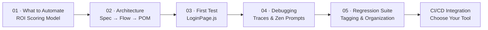

# AI-Assisted QA: From Manual Tester to Automation Strategist
## Section 02: Advanced — Building Real Automation That Lasts

> **Series Navigation**
> [← Section 01: Foundations](../01-foundations/README.md) | **You are here: Advanced** | [Section 03: Expert →](../03-expert/README.md)

---

## What This Section Covers

Welcome to the **Advanced** section. If you've completed the Foundations section, you understand what test automation is and why it matters. Now we go deeper — into the decisions, architecture, and daily workflows that separate a hobbyist from a professional automation engineer.

This section was designed with one belief: **you don't need to become a developer to write great automated tests.** You need the right mental models, the right tools, and a partner like **Zen** (Zenflow's AI assistant) to fill the gaps.

By the end of this section, you will be able to:

- Decide **what to automate** using a data-driven ROI scoring model
- Understand the **architecture** behind maintainable test code
- **Convert your first manual test** into a working Playwright spec
- **Debug failing tests** using Playwright's built-in tools and Zen's guidance
- **Build a regression suite** that grows with your product
- **Integrate your suite** into a CI/CD pipeline using the tool your team already uses

---

## Section Map

```
02-advanced/
├── README.md                        ← You are here
├── 01-what-to-automate.md           ← ROI scoring, decision matrix, what NOT to automate
├── 02-architecture-explained.md     ← Spec → Flow → Page Object model, SOLID in plain English
├── 03-convert-first-test.md         ← Step-by-step: your first Playwright test
├── 04-debug-failing-tests.md        ← Error types, traces, Zen prompts, flakiness
├── 05-build-regression-suite.md     ← Tagging, organization, config, data strategy
└── ci-tools/
    ├── README.md                    ← CI/CD tool comparison and selection guide
    ├── 01-github-actions.md         ← Full GitHub Actions workflow setup
    ├── 02-gitlab-ci.md              ← Full GitLab CI pipeline setup
    ├── 03-jenkins.md                ← Full Jenkins declarative pipeline
    ├── 04-circleci.md               ← Full CircleCI config with orbs
    └── 05-azure-devops.md           ← Full Azure Pipelines YAML
```

---

## The Advanced Learning Path

Work through the topics in order. Each builds on the last.



Estimated time per topic:

| Topic | Reading Time | Hands-On Time | Total |
|-------|-------------|---------------|-------|
| 01 · What to Automate | 15 min | 30 min | 45 min |
| 02 · Architecture | 20 min | 20 min | 40 min |
| 03 · First Test | 10 min | 60 min | 70 min |
| 04 · Debug Failing Tests | 15 min | 45 min | 60 min |
| 05 · Regression Suite | 20 min | 45 min | 65 min |
| CI/CD Integration | 20 min | 90 min | 110 min |
| **Section Total** | **~100 min** | **~290 min** | **~6.5 hrs** |

---

## Prerequisites

Before starting this section, make sure you have:

- [ ] Completed Section 01 (Foundations) or have basic familiarity with Playwright
- [ ] Node.js 18+ installed (`node --version`)
- [ ] A code editor (VS Code recommended)
- [ ] Playwright installed in your project (`npm init playwright@latest`)
- [ ] Access to Zen (Zenflow) for AI assistance

If you're missing any of these, go back to [Section 01: Foundations](../01-foundations/README.md).

---

## The Role of Zen Throughout This Section

In each topic, you'll see **"Ask Zen"** callouts. These are real prompt templates you can use with Zen to get immediate, accurate help — without needing to know the exact syntax or remember every Playwright API.

> **Example "Ask Zen" prompt:**
> ```
> I'm a QA engineer learning Playwright. I have a manual test case that tests login
> with valid credentials. Can you help me convert it to a Playwright test using
> the Page Object Model pattern? Here's the manual test:
> [paste your test case]
> ```

Zen understands context. The more detail you provide, the better its output.

---

## Mindset Shift for This Section

Before you dive in, internalize these three mindset shifts:

### 1. You Are the Domain Expert
Developers know *how* to write code. You know *what* needs to be tested. That knowledge is more valuable. Your job is to bring the "what" and let Zen help with the "how."

### 2. Maintainability > Coverage (At First)
10 tests you maintain are worth more than 100 tests you abandoned. Focus on building clean, well-structured tests before chasing coverage numbers.

### 3. Automation Augments, Doesn't Replace
The goal is not to eliminate manual testing. It's to eliminate *repetitive* manual testing so you can focus on exploratory, edge-case, and experience-based testing — the work that actually requires human judgment.

---

## Glossary for This Section

| Term | Plain English Meaning |
|------|----------------------|
| **Page Object Model (POM)** | A design pattern where each web page has its own JavaScript class that handles interactions with that page |
| **Spec file** | The test file — contains `test()` blocks that describe what you're testing |
| **Flow file** | A helper that orchestrates multi-step user journeys (e.g., "complete checkout") |
| **Selector** | The CSS or other identifier that points to a specific element on the page |
| **Flaky test** | A test that sometimes passes and sometimes fails for non-deterministic reasons |
| **Trace** | A recording of everything that happened during a Playwright test run |
| **CI/CD** | Continuous Integration / Continuous Deployment — automated pipelines that run tests on every code change |
| **Smoke suite** | A small, fast set of tests that verify the most critical paths work |
| **Regression suite** | A broader set of tests ensuring new changes don't break existing functionality |
| **Artifact** | Files saved by CI (test reports, screenshots, videos) for later review |

---

## Quick Reference: Playwright Commands

You'll use these constantly. Bookmark this table.

```bash
# Run all tests
npx playwright test

# Run a specific file
npx playwright test tests/login.spec.js

# Run tests with a specific tag
npx playwright test --grep @smoke

# Run in headed mode (see the browser)
npx playwright test --headed

# Run in debug mode (step through)
npx playwright test --debug

# Open the trace viewer
npx playwright show-trace trace.zip

# Generate tests interactively (codegen)
npx playwright codegen https://your-app.com

# Run on a specific browser
npx playwright test --project=chromium

# Run with HTML report
npx playwright test --reporter=html
npx playwright show-report
```

---

## Sample Project Structure

Throughout this section, we'll build toward this project structure. You'll understand every file by the time you finish.

```
your-qa-project/
├── playwright.config.js          # Main configuration
├── package.json
├── tests/
│   ├── specs/                    # Your test files (.spec.js)
│   │   ├── auth/
│   │   │   └── login.spec.js
│   │   ├── checkout/
│   │   │   └── checkout.spec.js
│   │   └── dashboard/
│   │       └── dashboard.spec.js
│   ├── flows/                    # Multi-step user journey helpers
│   │   ├── auth.flow.js
│   │   └── checkout.flow.js
│   └── pages/                   # Page Object Model classes
│       ├── LoginPage.js
│       ├── DashboardPage.js
│       └── CheckoutPage.js
├── test-data/                   # Static and dynamic test data
│   ├── users.json
│   └── products.json
├── fixtures/                    # Playwright fixtures (advanced)
│   └── auth.fixture.js
└── .github/
    └── workflows/
        ├── pr-smoke.yml
        └── nightly-regression.yml
```

---

## What Makes a "Good" Automated Test?

Before writing a single line of code, understand what you're aiming for. A good automated test is:

| Quality | What It Means | Red Flag |
|---------|---------------|----------|
| **Deterministic** | Same inputs → same result every time | Test passes Monday, fails Friday |
| **Independent** | Doesn't rely on other tests running first | Test only works when run after test #3 |
| **Fast** | Completes in < 30 seconds (ideal < 10s) | Test takes 3 minutes to run |
| **Readable** | Another tester can understand what it tests | You can't explain what the test does in one sentence |
| **Maintainable** | When the UI changes, you update one file | Changing a button label breaks 30 tests |
| **Atomic** | Tests one thing | Test verifies login AND dashboard AND profile |

---

## Let's Get Started

Start with **[01 - What to Automate](./01-what-to-automate.md)** — because writing automation for the wrong things is the #1 mistake new automation engineers make. The ROI scoring model will save you weeks of wasted effort.

---

*Questions? Drop them to Zen: "I'm in the Advanced section of the QA blog series and have a question about [topic]."*
